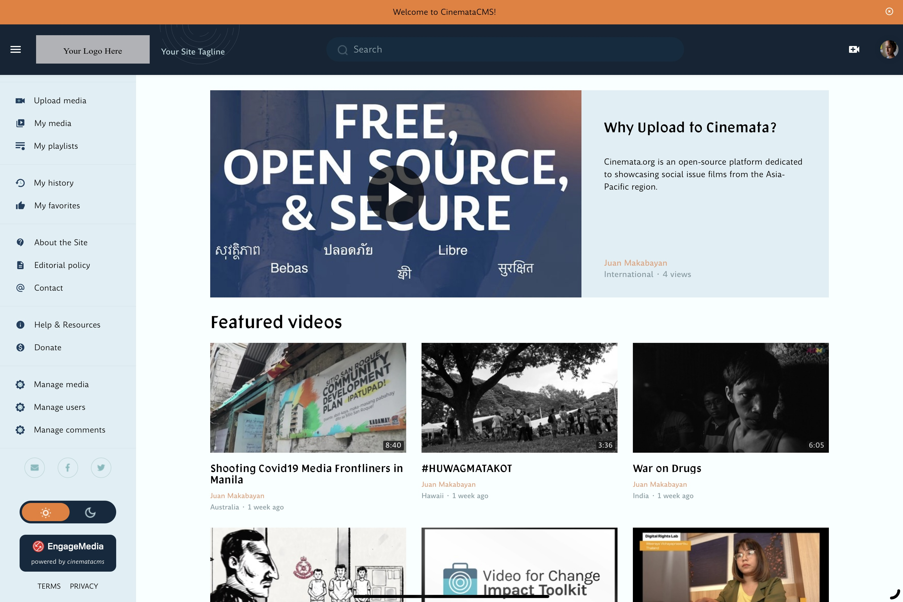
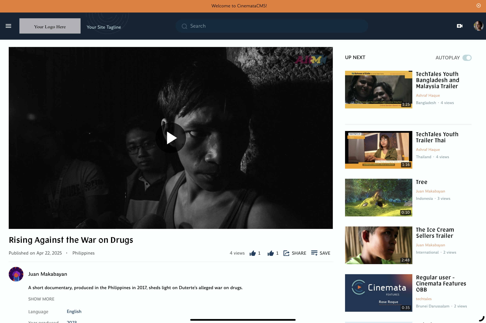
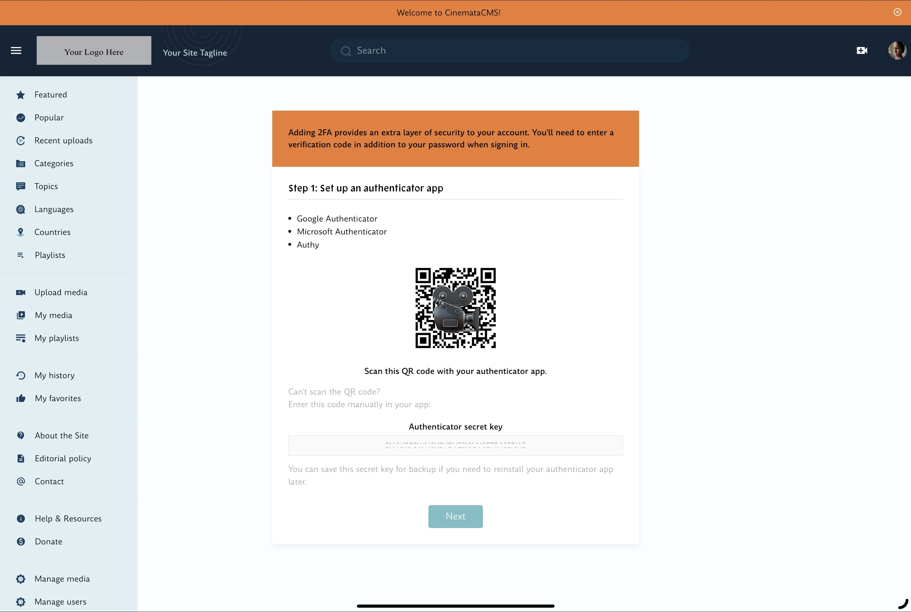

## CinemataCMS: An Enhanced MediaCMS-based Video Platform for Asia-Pacific Social Issue Films

[Cinemata](https://cinemata.org) is an open-source project that builds upon [MediaCMS](https://github.com/mediacms-io/mediacms), enhancing it with features specifically designed for showcasing social issue films from the Asia-Pacific region. Since its public release in 2021, Cinemata has developed numerous features that were previously exclusive to its platform and not available in the core MediaCMS. The project is managed by EngageMedia, an Asia-Pacific non-profit advocating for digital rights, open-technology and social issue films.

Our goal is to make these Cinemata-specific integrations and improvements to MediaCMS available to the public, enabling more organizations to maximize the potential of this powerful video content management system.

### Key features:
- [Core MediaCMS features](https://github.com/mediacms-io/mediacms)
- Cinemata-specific enhancements:
  - [Multi-Factor Authentication](https://github.com/EngageMedia-Tech/cinematacms/blob/main/docs/guides/mfa_authentication.md)
  - Custom CSS and UI components for a unique, tailored look distinct from baseline MediaCMS
  - Featured video and playlists on the front page
  - Customised playlists and embedding options on the front page
  - Integration of [whisper.cpp](https://github.com/ggml-org/whisper.cpp) ASR model for English translation
  - Ability to upload, edit, and download .SRT files for subtitles or captions
  - Expanded user roles that include a Truster User, who has greater access to site features relating to publishing and the ASR model.
 
### Potential Use Cases for CinemataCMS
CinemataCMS can serve a wide range of organizations and initiatives that need to manage, showcase, and distribute video content with a focus on social impact:

- **Educational institutions** - Universities, film schools, and educational programs can use CinemataCMS for teaching references, student submissions, and creating accessible archives of instructional materials
- **Community archiving initiatives** - Cultural and community organisations working to preserve local stories and historical footage
- **Film festivals** - Both virtual and physical film festivals looking for platforms to showcase submissions and curated collections
- **Independent media organisations** - News outlets, documentary collectives, and citizen journalism projects requiring secure hosting for sensitive content
- **Human rights documentation** - NGOs and advocacy groups documenting human rights situations in sensitive contexts
- **Cultural heritage preservation** - Museums, libraries, and archives digitising and showcasing audiovisual cultural heritage
- **Environmental advocacy** - Organisations using video to document environmental issues and climate change impacts
- **Research institutions** - Academic and scientific organisations sharing visual research outputs and findings
- **Digital storytelling projects** - Initiatives promoting digital storytelling as a tool for empowerment and social change

The platform's emphasis on privacy, security, and community engagement makes it particularly suitable for projects prioritising ethical content management and user protection. 

### Screenshots

<p align="center">
    
    
    
    
</p>

### History

Cinemata's content originates from EngageMedia's previous video platform, which operated from 2006 to 2020 using the Plumi video content management system. By migrating this valuable archive to an improved MediaCMS-based platform, we're ensuring the preservation and continued accessibility of essential narratives from the region. Since its launch, the current Cinemata site has added more than 2,000 videos contributed by its active users, further enriching its collection of social issue films. Cinemata is co-developed by Markos Gogoulos of MediaCMS.

“Cinemata” comes from the combination of “cine”, which means “motion picture”, and “mata”, which means “eye” in several regional languages:

- In Bahasa Malaysia, Bahasa Indonesia, and Filipino, the word for “eye” is “mata”
- In Tetum (East Timor), the word for “eye” is “matan”
- In Vietnamese, the word for “eye” is “mắt”
- In Thai and Lao, the word for “eye” is “ta”

“Cinemata” represents our focus on highlighting Asia-Pacific perspectives and connecting issues, films, and filmmakers in the region.

### Cinemata 2.0

With Cinemata 2.0, we're building a community of developers, designers, and contributors who share our vision of bringing critical but often overlooked stories to the forefront. Join us in creating an enhanced version of MediaCMS that connects filmmakers, advocacy groups, human rights defenders, educators, and audiences through collaborative initiatives such as film screenings, archiving, curation, outreach, and promotion.

Help us empower voices across the Asia-Pacific and foster meaningful discussions on pressing social issues. By contributing to this project, you'll be part of an effort to make these powerful tools available to a wider range of organizations, amplifying the impact of visual storytelling for social change.​​​​​​​​​​

# Cinemata 2.0 Roadmap

## [Milestone 1: 3 to 6 months](https://github.com/EngageMedia-video/cinematacms/milestone/4)

#### 1. Security and Privacy Improvements
- Implementation of security audit recommendations
- Improved authentication and authorization systems
- Enhanced privacy controls for content access
  
#### 2. Open-sourcing initiative
- [Create comprehensive developer documentation and API references](https://github.com/EngageMedia-video/cinematacms/issues/56)
- [Develop user guides with visual tutorials for common workflows](https://github.com/EngageMedia-video/cinematacms/issues/60)
- Initiate outreach programs targeting FOSS communities in Southeast Asia
- Organize virtual workshops and hackathons to encourage community involvement

#### 3. [Cloudflare Integration & File Upload System Improvements for CinemataCMS](https://github.com/EngageMedia-video/cinematacms/issues/20) 
- Implementation of a reliable chunked upload system
- Cloudflare Pro integration and configuration
- Upload size management based on user roles
- Enhanced upload progress monitoring and error handling

#### 4. [Rich Text Input Enhancements](https://github.com/EngageMedia-video/cinematacms/issues/6)
- Upgrade the existing rich text formatting functionality in Media and Static pages input fields to improve user experience, increase reliability, and expand formatting options
- Add form creation support in sidebar pages to host Trusted User applications

## [Milestone 2: 6 months to one year](https://github.com/EngageMedia-video/cinematacms/milestone/2)

#### 1. [Enhance Community Engagement Features](https://github.com/EngageMedia-video/cinematacms/issues/30)
- Enhance the comments and likes interface and related moderation tools
- Build the ability to follow other users
- Develop a notification system for new content and interactions

#### 2. [Enhance Co-viewing Experience](https://github.com/EngageMedia-video/cinematacms/issues/35)
- Synchronized video viewing
- Group watch features
- Live chat during viewing
- Virtual screening rooms

#### 3. [Localisation](https://github.com/EngageMedia-video/cinematacms/issues/34)
- Multi-language interface
- Subtitle management improvements
- Regional content categorization
- Culturally relevant features

#### 4. [Expanded Django Admin Functionality](https://github.com/EngageMedia-video/cinematacms/issues/36)
- Enhanced content management tools
- User management improvements
- Manage transcodes and Whisper.cpp functionalities via Django admin
- Batch operations for content

#### 5. [Expand notification triggers](https://github.com/EngageMedia-video/cinematacms/issues/29) 
- Comments on user's content
- Likes on user's content
- User's promotion to a Trusted User and other user roles

#### 6. [Content Curation and Discovery](https://github.com/EngageMedia-video/cinematacms/issues/33)
- Advanced search capabilities
- Recommendation engine improvements
- Collections and playlists
- Featured content management

#### 7. [Video Upload Process Enhancements](https://github.com/EngageMedia-video/cinematacms/issues/32)
- Redesign the upload flow to allow metadata input before video upload
- Add the ability for users to easily remove or replace uploaded videos
- Implement a progress bar and estimated time for video processing

#### 8. [Add Monetization Options](https://github.com/EngageMedia-video/cinematacms/issues/27)
- Build a donation system for viewers to support content creators via mobile wallets

#### 9. [Members-only Features](https://github.com/EngageMedia-video/cinematacms/issues/28)
- Unique featured video and playlists on the front page as a precursor for 'Cinemata Premium/Prism'

#### 10. Cloud Infrastructure Exploration
- Move media processing (video transcoding, thumbnail generation, Whisper translations) to cloud-native platform while maintaining current core infrastructure
- Set up content delivery optimization through cloud services
- Implement monitoring system for cloud resource usage

## [Milestone 3: 2 to 3 years](https://github.com/EngageMedia-video/cinematacms/milestone/3)

#### 1. [Enhanced Site Design Layout](https://github.com/EngageMedia-video/cinematacms/issues/26)
- New color scheme and typography
- Improve the appearance of the playlist page

#### 2. [Live Streaming Integration](https://github.com/EngageMedia-video/cinematacms/issues/25)
- Develop infrastructure to support live-streaming
- Implement features for scheduled streams and notifications

#### 3. [Creator Dashboard](https://github.com/EngageMedia-video/cinematacms/issues/24)
- Develop a basic analytics dashboard for content creators
- Include metrics like views, engagement rates, and viewer demographics

#### 4. [Develop an Advanced Creator Tools](https://github.com/EngageMedia-video/cinematacms/issues/23)
- Add the ability to schedule content releases and set availability periods

#### 5. [Mobile Platform Development](https://github.com/EngageMedia-video/cinematacms/issues/22)
- Develop and launch a mobile-optimised version of Cinemata
- Enhance platform accessibility and user experience across devices

#### 6. Community Screening Features
- Implement tools for online community screening and small film festival events

## 🤝Paid Development Opportunities💼

In addition to volunteer contributions, CinemataCMS offers paid development opportunities specifically for Southeast Asian developers. These opportunities are part of our commitment to supporting regional tech talent.

### How it works:
- Specific roadmap features may be designated for paid development
- Southeast Asian developers can apply through our [Expression of Interest Form](https://airtable.com/app4WS5NS7qe0Pc7s/pagHGqVvJ3PbaBHfS/form)
- Selection is based on relevant skills, experience, and commitment to the project's vision

Note that many features and improvements remain open for volunteer contributions from our global community.

##  🚀 Installation
The instructions have been tested on Ubuntu 22.04. Make sure no other services are running in the system, specifically no nginx/Postgresql, as the installation script will install them and replace any configs.

As root, clone the repository on /home/cinemata and run install.sh:

### For Beta Users (Stable)

```
# cd /home
# mkdir cinemata && cd cinemata
# git clone -b release/cinemata-2.0-beta https://github.com/EngageMedia-video/cinematacms.git cinematacms && cd cinematacms
# chmod +x install.sh
# ./install.sh
```
### For Development (Latest)
```
# cd /home
# mkdir cinemata && cd cinemata
# git clone https://github.com/EngageMedia-video/cinematacms cinematacms && cd cinematacms
# chmod +x install.sh
# ./install.sh
```
⚠️ Note: Main branch contains latest development code and may have unstable features.

This should take a few minutes with dependencies etc. Make sure you enter a valid domain when asked (eg staging.cinemata.org)

**Note**: For locally setting up the application in Mac OSX (Ventura 13.0 and Sequoia 15.2), you may refer to [this guide](docs/mac_setup.md) for more information.

**Check out [Index](docs/index.md)** for more information. 

## Contributors

Thanks to all the amazing people who have contributed to this project:

[Markos Gogoulos](https://github.com/mgogoulos)
[Yiannis Stergiou](https://github.com/styiannis)
[Anna Helme](https://github.com/ahelme)
[King Catoy](https://github.com/Kingcatz)
[Ashraf Haque](https://github.com/securenetizen)
[Jay Cruz](https://github.com/jmcruz14) 
[Adryan Eka Vandra](https://github.com/adryanev)

Want to contribute? Check out our [contribution guidelines](docs/CONTRIBUTING.md).
