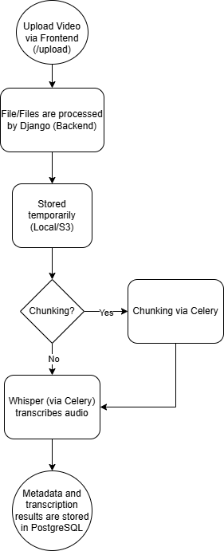

# Media Processing Pipeline

CinemataCMS's sophisticated media processing pipeline is a core component that transforms raw uploaded files into optimized, streamable content with transcriptions. This documentation is critical because it exposes the "black box" of media handling, helping developers understand how [encoding](upload-process.md) profiles are applied, how large files are [chunked](video-processing-overview.md) for parallel processing, and how [transcriptions](whisper-speech-reconition.md) are generated. Without this documentation, troubleshooting encoding failures or extending the pipeline becomes significantly more difficult, potentially leading to performance issues or broken functionality.

---

---